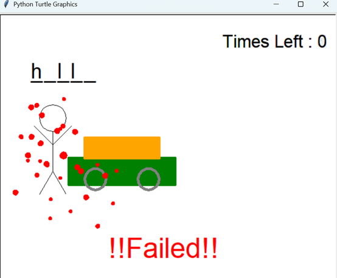

# 🎮 Hangman Game with Turtle Graphics

A Python-based **Hangman Game** that uses `turtle` graphics for visual feedback!  
Guess the correct word before a car crashes into the stick figure... or else! 💥

---

## 🕹 Gameplay Overview

- One player inputs a secret word.
- The second player guesses one letter at a time.
- The stick figure stands near a moving car 🚗.
- Each wrong guess moves the car closer...
- Guess the whole word before the car hits the person!

---

## ✏️ Features
- Word masking using underscores (e.g., _ _ _ _)
- Real-time letter input via textinput() pop-up
- Animated car moving closer with each wrong guess
- Custom drawing of:
  Stick figure 🧍
  Car 🚗
  Blood splatter 💥 (on failure)
  Win/lose messages (!!SUCCESS!!, !!Failed!!)

---

## 🖼 Screenshots(Results)

### ✅ Success


---

### ❌ Failure


---

## ▶️ How to Run

Make sure you have **Python 3.x** installed, then run:

```bash
python hangman.py
```
The game will launch in a turtle graphics window. One player will be prompted to enter a word. The guessing begins after that!

🐢 No external libraries required – uses only built-in turtle, time, and random modules.

